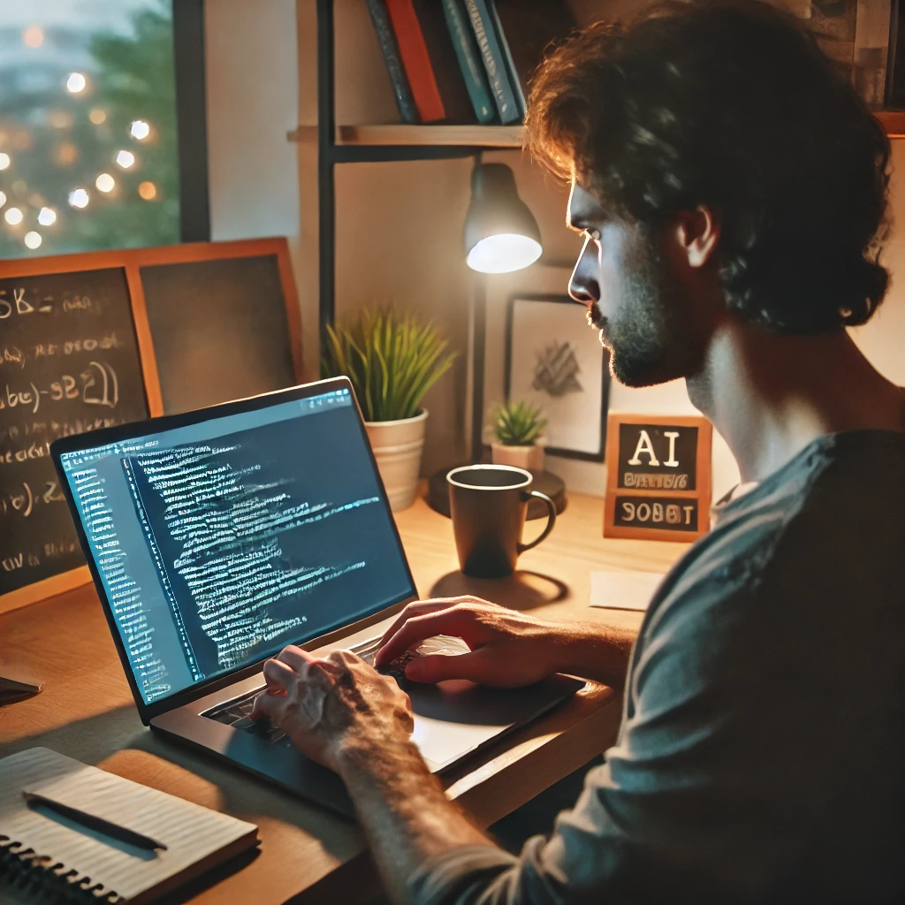

# My Fears about AI

This article is mostly a brain dump not AI-polished of my feelings and fears about AI. Take it as it is.

As it is customary with this kind of articles, where do I stand about AI?

I really believe that LLMs are huge, as huge as Excel, as huge as Google, possibly as huge as Internet. Some AI skeptics believe that ChatGPT is barely more than a probabilistic parrot, just a fad. That's just not it. I know so many people that rely on it daily to do big part of their jobs, teachers to create material, lawyers to organize...

On the other hand, I just hadn't drunk the Kool-Aid. Will the AI overlords come to dominate us in a Matrix-like war, I really disbelieve it. Will this completely end Software Engineering? Maybe I'm just biased and looking for comfort, but it doesn't look anywhere close. Will we have AGI? Maybe, maybe not, we'll get there when we get there, nothing I change will make a difference.

## My fears

* AI is here, and now it seems that nothing else matters. Google used to praise itself on how fast it was. Now, I need to wait 4 seconds looking at an empty loading page, while I scroll to the actual results. Security? [Meh](https://www.cnbc.com/2025/01/27/deepseek-hit-with-large-scale-cyberattack-says-its-limiting-registrations.html). When I open JIRA, what I want is that UX does not suck, doesn't go crazy slow, and search works (this could actually be a usage of AI). Not an AI button that tries and fails to create the tickets that I need.
* AI will always give you an answer. In pre-AI times, if I were to look something online, it could be that you didn't find it, or I found something wrong. But somebody had taken the effort to write that information. There was at least people thinking about it. AI will just try too hard to provide an answer. The other day we were checking some real life obscure question, ChatGPT promptly made us a really nice explanation. When asked for references, he apologized and said it was all bogus.
* We'll have a huge epistemological crisis. It will be very hard to know what's true and what not. To be honest, we are already in it, independent of AI. If you look at politicians you'll find that it is become acceptable to say blatant lies and not bat an eye. But that is not the issue. The issue is right now there is a huge chasm (say democrats, republics). Wherever you stand there, when you try to communicate with the other part, you'll realize that their vision of the world is completely different from yours. Are Republicans completely living in a Fake World, or is their world real, and I'm fake news? This is already worrisome. With AI, it will only get worse, and it will extend to all fields, not just politics. Search for images on the internet, are they real? Are they not? Is this a veritable source of truth? Did it get hallucinated? To make this crisis worse, LLMs of the future will be trained on mostly AI generated content. Third generation LLMs will be trained on second generation content, and so on and so on.
* Our skepticism about AI is just too low. Maybe we are just in the honeymoon period, but I see people accepting things that before were just unacceptable. In a recent training, ChatGPT transformed "Fake data:", to "From Market Research:". I found it funny at the time. But in reality, this is like the classical Excel Date problem, but 100x worse. When I do code interview to candidates, and even with coworkers. I constantly see one-line autocomplete suggestions that are just not it. People autocomplete, delete and rewrite, that's just so inefficient, just disable it.
* Writing makes me think. [Amazon](https://www.dardiscommunications.com/2018/10/why-jeff-bezos-cares-so-much-about-writing-and-so-should-you) has a long story of making people write instead of talk as a way to consolidate ideas. I don't want ChatGPT to do the writing for me. I want to sit down and force myself to clarify those ideas.
* Our brains are too lazy, or "if you don't lose it you lose it". Lots of comments online of people that are no longer capable of writing code independently. However, here it is the actual thinking that we are talking about. Of course, the counter-point here would be that I use Google Maps all the time and still I can navigate a city on my own.
* It makes me sad that AIs will be talking to AIs. I see a lot of people saying, write a draft list of points, give it to ChatGPT. But I also see a lot of people saying, take a long article, and use ChatGPT to convert it to a short list. Why not just talk between us and skip the middle man? This will extend to everything. Scammers using AI and people using AI to detect is somebody is a scammer. Both people in a Tinder match using AI in their first interactions. It just makes me sad. There was this tale of Isaac Asimov, where nobody would go out and would teleport around in the sake of efficiency. One day, teleport breaks and everybody panics. This little girls steps out and discovers a world full of light and green. This is similar, skip the middle man, connect with the other person.
* I have FOMO. This is more of a personal fear. But I see everybody around me, developers and not developers using it daily on their work, completely into it. Yet, my usage is super limited, find me this word I don't remember, explain me this obscure API, but that is it. Maybe I'm an old fart? There is [this book from Terry Pratchett](https://discworld.fandom.com/wiki/Reaper_Man) where Death decides to take some time off and go to the countryside. At some point it ends up in a harvest competition. Death with the sharpest scythe, against a young farmer with a new tractor. I feel like that sometimes, I've polished my coding tooling so much that I can keep up, but maybe next day the next model tractor will be unbeatable and my tools will stay as they are.
* Climate crisis? We were planning/faking to seek carbon-neutrality. Not anymore, burning compute at AI is an excuse. I want to think that this is only the early stages. First computer needed it's own dedicated power plant, now they run on batteries. Problem is, climate crisis is around the corner, we don't have that much time.
* Google will die. I know, Google is a monopoly, they have all your data... But reality is, they managed to create good things. Life without gmaps is a mess. Life without gmail is a mess. Browsing before Chrome was a mess. Free Google Drive is very convenient as a student. Life without Google login is quite annoying. All those things were possible because they were printing money. They have so much money from Google Ads that they could invest on other parts that were actually beneficial for everybody. But that is gone. So many people around me only use ChatGPT to access information. It's a matter of time that companies start paying OpenAI for ads. Let's hope they are not inlined.

## Further thoughts

I read so many people arguing that LLMs are just parrots and that they will never achieve AGI. On the other hand, at the very least, ChatGPT is very good at faking it is conscious. It does pass [Turing test](https://www.nature.com/articles/d41586-023-02361-7).

Maybe, it's just that we are not that special. For thousands of years humans had soul and that set us apart from animals including monkeys. Some people cannot yet accept that there is a continuous path Monkeys and Humans. What if our minds are also not that special. Nature figured it out, maybe we can fake it.

