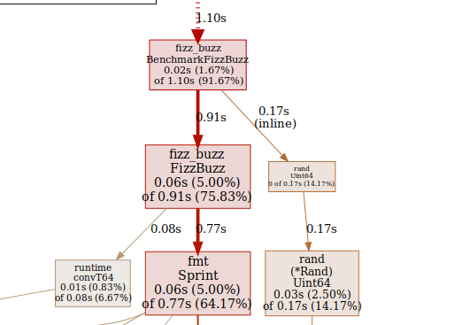
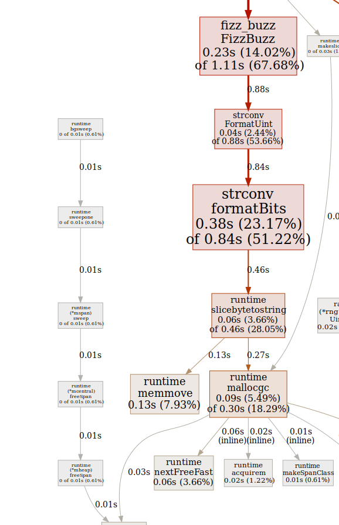

## Optimizing FizzBuzz algorithm in Go
FizzBuzz is very standard interview question. It is simple enough to write it in a few lines, and it covers a bit of basic notions like ifs, overlapping conditions, int manipulation. In this article I'll use it as a showcase of the process to optimize code in Go.

### Step 0. Write it dummy
Before we start optimizing the code, we need to write a working code that we are confident in.
We will use it as a speed baseline, but also to validate the correctness of the next versions, as Knuth would say "Premature optimization is the root of all evil".

```go
func FizzBuzz (input uint) string {
	if input % 15 == 0 {
		return "FizzBuzz"
	}
	if input % 3 == 0 {
		return "Fizz"
	}
	if input % 5 == 0 {
		return "Buzz"
	}
	return fmt.Sprint(input)
}
```

Note that we are not printing the value, because that it would be harder to test, we are returning a string that we can check.

### Step 1. Test and Benchmark
The dummy implementation cannot be complete if we do not test it, we'll also need a benchmark to get a baseline for improvement.

```go
func TestFizzBuzz(t *testing.T) {
	testCases := []struct{
		input uint
		output string
	} {
		{0, "FizzBuzz"},
		{1, "1"},
		{2, "2"},
		{3, "Fizz"},
		{4, "4"},
		{5, "Buzz"},
		{6, "Fizz"},
		{7, "7"},
		{8, "8"},
		{9, "Fizz"},
		{10, "Buzz"},
		{11, "11"},
		{12, "Fizz"},
		{13, "13"},
		{14, "14"},
		{15, "FizzBuzz"},
		{16, "16"},
		{17, "17"},
		{18, "Fizz"},
	}

	for _, test := range testCases {
		output := FizzBuzz(test.input)
		assert.Equal(t, test.output, output)
	}
}
``` 

Side note, you can check [here](https://medium.com/@furstenheim/multi-cursors-for-intellij-de88f2dfeabc) how to easily write this test with multicursors in Intellij.

So far so easy, let's do the benchmarking:

```go
func BenchmarkFizzBuzz(b *testing.B) {
	for i := 0; i < b.N; i++ {
		FizzBuzz(uint(rand.Uint64()));
	}
}
```

We run it with `go test --bench=.` and obtain:

```
BenchmarkFizzBuzz-12    	14538255	        79.1 ns/op
PASS
ok  	fizz_buzz	1.237s
```
The astute reader, will have notice that we are not benchmarking correctly, but we'll go back to that later.

### Step 2. Low hanging fruits
A big part of the optimization is to understand what is slow, and go has the right tool to do that

```go
go test --bench=. -cpuprofile cpu.prof
go tool pprof -svg cpu.prof > cpu.svg
```



We can see two things. First is that we are measuring time in getting the random number, and that is not even part of our function. Second one is that `fmt` eats a big part of our runtime. Both are very easy to fix.

First we split calls to the random function and benchmarking of our test

```go
func BenchmarkFizzBuzz(b *testing.B) {
	input := make([]uint, b.N)
	for i, _ := range input {
		input[i] = uint(rand.Uint64())
	}
	// Our benchmark starts here 
	b.ResetTimer()
	for _, v := range input {
		FizzBuzz(v);
	}
}
```

```
BenchmarkFizzBuzz-12    	17317704	        66.3 ns/op
PASS
ok  	fizz_buzz	1.499s
```    

Huh, we have just improved our benchmark a 16% and we haven't even modified the code!!

To improve the conversion, we just need to google a bit and find that `strconv.FormatUint(uint64(input), 10)` is more efficient than `fmt.Sprint(input)`. After the changes we get a solid 50% improvement.:

```
BenchmarkFizzBuzz-12    	32271152	        34.0 ns/op
PASS
ok  	fizz_buzz	1.632
```

## Step 3. Can we do better?
It turns out that we actually can, albeit really little. As we can see in our current graph, formatting the uint is the dominating factor taking a 80% of the time. This means that we can only fight for the reminding 20%.



Not only that, we are allocating memory and that affects a lot the benchmarks, it makes the benchmarks more unstable, and it requires time to free the space.

## Step 4. Microptimization
Normally, one would have stopped in the previous step, since the gain is not worth the effort. But for the sake of the article, let's fight for an extra inch. There are two things that are specially slow in microoptimization: branches and division, and we can reduce both.

Currently, we are performing three divisions to obtain the reminders modulo 3, 5 and 15. However, the last one contains the information about the other two. Similarly, we are having 4 cases, but in fact, there are only two. Returning the original number or the changed string. With a bit of ugly code we get:

```go
func FizzBuzz (input uint) string {
	reminder := input % 15
	if memoizedReturnNumber[reminder] {
		return strconv.FormatUint(uint64(input), 10)
	}
	return memoizedValue[reminder]
}
```
Where `memoizedReturnNumber` is `[15]bool{false, true, true, false...` and memoizedValue is `[15]string{"Fizz", "", "", "Fizz", ...`

If we run both benchmarks we see that the new implementation is 1-2 nanoseconds faster, around a 4% faster.

```
BenchmarkFizzBuzzSlow-12        	33702345	        33.9 ns/op
BenchmarkFizzBuzz-12            	36585849	        32.2 ns/op
```

However, we are not done yet. The new code is considerably harder to read, so it needs better testing. Luckily, we already have an existing implementation, so we can do differential testing.

### Step 5. Differential testing
Differential testing consists of comparing the outputs of two programs against each other. This technique is specially powerful when optimizing. You keep an old implementation that has simpler code and compare the outputs of optimized and unoptimized functions.

```go
func TestFizzBuzz_DifferentialTesting(t *testing.T) {
	for i := 0; i < 10000; i++ {
		input := uint(rand.Uint64())
		outputSlow := fizzBuzzSlow(input)
		output := FizzBuzz(input)
		assert.Equal(t, outputSlow, output)
	}
}
```

### Bonus. Batch processing
The standard question for FizzBuzz is to compute it for all numbers from 1 to 100. In that case we can even skip the division by 15.

That's all. Thanks for reading I hope that you enjoyed it.
