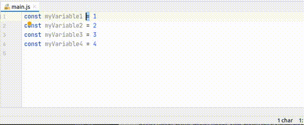
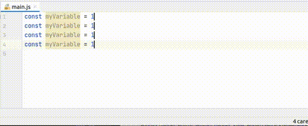
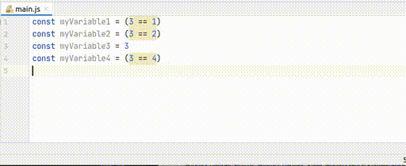

# Multicursors in Intellij
One of the best features of IDEs are multicursors. VsCode, Sublime and Intellij they all have it. If you learn to use them, you'll notice a boost in productivity. 

Multicursors are great when you need to work with tabular data, for example arrays or data extracted from the database, when you need to write similar code like asserting in tests and many more.

There are a lot of ways to use multicursors in Intellij, but most of the developers don't know them. Here I present a few.

### Multicursors
For those that are unaware, multicursors work like a single cursor but in multiple places (who would have guessed), so every action you take affects all the places at the same time. It's possible to combine them with everything that you already know, expand selection, duplicate, change case... 

For the mouse inclined 🙈 you can do it with Alt + Left Click, but there are much better ways.

### Clone caret below
My favourite way to create multicursors is cloning the caret below, it is the most intuitive one. It will create another caret in the same position of the next line. Surprisingly it does not have a shortcut. In my case I have assigned Ctrl + Shift + Down.

### Add selection
Add selection (Alt-J    , \^-G  ) is a very common way to get multicursors. You start from the selection of a word and create a new selector in the next appearance. It is possible to skip one by using Find Next (F3   , ⌘-G ).
 

### Create sequence
[String manipulation](https://plugins.jetbrains.com/plugin/2162-string-manipulation) is a cool plugin for intellij. It supports converting from CamelCase to snake_case, snake_case to kebab-case... And it supports "Create sequence", this is a super power with multicursors. It increases a sequence starting from the value selected in the first cursor. Very useful at tests, both for creating mock data and for asserting information in arrays without looping.

### Multicursor in selection
It is possible to get a cursor at every instance of a character or word. For that, we select the portion of the text we are interested in (or nothing if the whole file). We launch replace (Ctrl-R    , ⌘-R ), type the sequence that we are interested in and press Alt-Enter, we'll get a cursor in every occurrence. We can even use regexes, to activate them we can use Alt-X.

### Multicursor for all lines
There are occasions where we want to get a cursor in each line. For example, we opened a csv and we need to modify every line it. One option would be to clone the caret from the beginning to the end. However, it could be a bit tedious if there are many lines. There is a much better way, the [Extra Actions Plugin](https://plugins.jetbrains.com/plugin/8213-extra-actions) offers a "Split selection into lines" which does exactly that:

### Conclusion
I hope that you see how easy is to work with multicursors in IntelliJ, and if you already knew about them you've learnt some new trick. If you know more things that can be done with multicursors, please add them in the comments.
