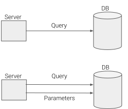
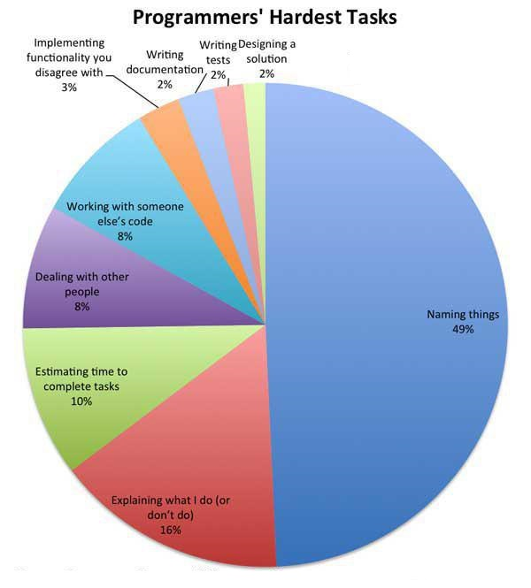

# SQL Best Practices. Part 1

Databases are complex beasts, and that is inherently necessary. They are stateful, handle concurrency, handle persistence to disk basically all the hard problems in programming. Additionally, they tend to have loose ownership, a big central source of truth that different applications and users consume and need to change continuously.

Thus, it is important to be specially careful about how we deal with them. Here are some good practices that I've gathered through the years.

## Always reference the table when using a field
SQL allows to write the same query in very different ways, which are roughly equivalent:

```sql 
SELECT user_id, user_name FROM application_user;
SELECT au.user_id, au.user_name FROM application_user au;
SELECT au.user_id, au.user_name FROM my_schema.application_user au;
```

If the table is in only one schema and there is only one table in the `FROM` part of the query, then all of them are equivalent. The first best practice is to **always reference the table of each field** (if you have at least two tables in the query). Consider the following query:

```sql
SELECT au.user_id, name, organization
FROM application_user
         JOIN organization ON application_user.organization_id = organization.organization_id
```

The query is perfectly valid and our sql engine will comply without any problem. However, it has two important problems:
* **You need the database schema to understand the query.** Is name the name of application_user or of the organization? We cannot know. Since code is read more times than it is written, we should strive for readability.
* It is **not future-proof**. Query is working today and our application is running. However, with just a small change in the schema, it becomes ambiguous, and it starts failing.
```sql
ALTER TABLE organization ADD COLUMN name varchar
```

There is a third reason for using table references. Consider the following query:

```sql
DELETE FROM application_user WHERE user_id IN (SELECT user_id FROM old_users);
```
It looks like a legitimate query, except that now you have deleted *all* users. The field for `old_users` was actually called `id` or maybe `old_user_id`, so the engine matched it with the parent table. Basically, **when using subqueries we might point to the wrong table and change completely the meaning of a query**.

## Use parametric queries. Even for testing
Parametric queries look very similar to normal queries.

In Python with parameters:
```python
insert_stmt = "INSERT INTO employees (emp_no, first_name, last_name, hire_date)  VALUES (%s, %s, %s, %s)"
data = (2, 'Jane', 'Doe', datetime.date(2012, 3, 23))
cursor.execute(insert_stmt, data)
```
In Python without parameters
```python
insert_stmt = "INSERT INTO employees (emp_no, first_name, last_name, hire_date) VALUES ({}, {}, {}, {})"
data = (2, 'Jane', 'Doe', datetime.date(2012, 3, 23))
cursor.execute(insert_stmt.format(*data))
```

However, they are intrinsically different.



Parameters flow in a different channel as the query. That means that the db engine will get the meaning of the query independent of the parameters and *then* apply those. That has several implications:

* It is bullet-proof against SQL. Parameters cannot modify the meaning of the query, because that meaning is computed without using them.
* Parametric queries are "type aware". The database knows what type of data is expecting, and it will correctly cast types or complain when it cannot.

Most people are aware of the first point, and it is relatively hard to find non-parameterized queries in production code. On the other hand, a lot of people avoid parameters in test code, because it is "easier" and there is no security implications. However, consider the following example

```javascript
function createFakeEmployee (position) {
  const fakeDataQuery = `INSERT INTO employees (emp_no, first_name, last_name, position)
        VALUES ('fake-id', 'fake-first-name', 'fake-last-name', '${position}')`
  dbClient.query(fakeDataQuery)
}
```

That testing code is actually wrong. Suppose that our schema allows position to be null, for example when the employee has been hired but hasn't yet been assigned the team. If we want to test that we'll be inserting `'null'` to the database instead of `NULL`. The only reason for this is that the query is *not type aware*. Had we used parameters it would've worked fine in all cases:

```javascript
function createFakeEmployee (position) {
  const fakeDataQuery = `INSERT INTO employees (emp_no, first_name, last_name, position)
        VALUES ('fake-id', 'fake-first-name', 'fake-last-name', :position)`
  dbClient.query(fakeDataQuery, { position })
}
```

## Choose your names wisely


Naming is hard, everybody knows it. However, naming in a database is even harder.
* Databases are consumed by other systems. When we are coding inside a server code is relatively easy to modify. Just change all occurrences and you are done. However, when a name is consumed, like in an API, a library or a database, things get trickier. If you are modifying an API, you'll probably need to expose old and new names, change all consumers and then remove the old name. However, that is not as easy on a database because:
* Databases are stateful. Suppose that we wanted to duplicate the column so that all consumers changed to the new column. While all the consumers are getting updated, there might be more data inserted into our old column, and we need to ensure that it is replicated to the new column. So we will also need to set up a trigger or a similar mechanism.
* Names are global. This point is really tricky. All identifiers are basically global in SQL. If you have a table named `users` that's it, there cannot be another (I'm ignoring schemas here). Something very standard is that when the business or a new feature is starting we assign easier names like `users`. However, we later realize that we need several tables for user, so now we'll have `application_users`, `internal_users` and `users`. And it is not clear what `users` might refer to. As a general rule of thumb, **always prefer names that have at least two words in it**.


## Use named parameters
Native sql does not allow named parameters, they only allow positional parameters:

```SELECT au.user_id FROM application_user au WHERE au.user_email = ? ```

And then parameters is passed as an array. In this case `[phony@example.com]`.

However, client code can work around this. For node.js there is [node-pg-spice](https://github.com/sehrope/node-pg-spice), [jdbc template](https://dzone.com/articles/how-to-specify-named-parameters-using-the-namedpar) for java also supports named parameters.

Once that is set, the query turns into:

``` SELECT au.user_id FROM application_user au WHERE au.user_email = :user_email  ```

Now the query is easier to read. Also, there are times when you need to build a query dynamically, with named parameters you can easily distribute responsibilities and compose different parts of the queries.

## Use comments
As we said before, names in databases are specially tricky and tend to stick forever. It's hard to always convey intention in names,  welcome comments. It's a relatively unknown feature of databases, but it is possible to comment about anything on a database. Columns, tables, functions...

```
CREATE TABLE app_features (
    id_app_features SERIAL NOT NULL PRIMARY KEY,
    name varchar(80) NOT NULL UNIQUE,
    displayed_name varchar(80) NOT NULL 
    );
    
COMMENT ON COLUMN app_features.name IS 'name is an internal human readable identifier used to reference features';
    
COMMENT ON COLUMN app_features.displayed_name IS 'displayed_name is a customer facing name that we''ll be displayed to the user when choosing the feature';

COMMENT ON TABLE app_features IS 'app_features holds the different features that a user can have access through upgrades';    
```

These comments will show up when looking at the full description of the table. This can be in datagrip, or if you are using psql by doing `\dt+` and `\d+`.

```
pgdb=# \dt+ app_features
                                                             List of relations
 Schema |     Name     | Type  | Owner  |  Size   |                                      Description                                       
--------+--------------+-------+--------+---------+----------------------------------------------------------------------------------------
 public | app_features | table | pguser | 0 bytes | app_features holds the different features that a user can have access through upgrades
(1 row)

```

```
pgdb=# \d+ app_features
                                                                                                                Table "public.app_features"
     Column      |         Type          | Collation | Nullable |                        Default                        | Storage  | Stats target |                                              Description            
                                   
-----------------+-----------------------+-----------+----------+-------------------------------------------------------+----------+--------------+---------------------------------------------------------------------
-----------------------------------
 id_app_features | integer               |           | not null | nextval('app_features_id_app_features_seq'::regclass) | plain    |              | 
 name            | character varying(80) |           | not null |                                                       | extended |              | name is an internal human readable identifier used to reference features
 displayed_name  | character varying(80) |           | not null |                                                       | extended |              | displayed_name is a customer facing name that we'll be displayed to the user when choosing the feature
 Indexes:
    "app_features_pkey" PRIMARY KEY, btree (id_app_features)
    "app_features_name_key" UNIQUE CONSTRAINT, btree (name)
Access method: heap
```

Database structure tends to stay, it's always risky to drop information and sometimes that might not even be possible to do due to regulation. These comments are a hint to the future developer, years from now of what they were meant for.


That's all for now. Happy coding