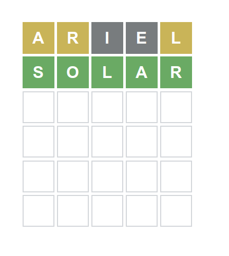
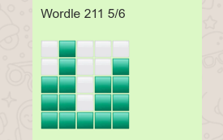
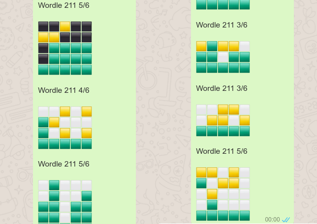
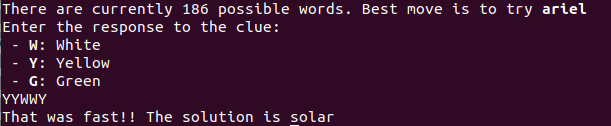

# Learning from the Mistakes of others: beating Wordle in just three Moves

Wordle is all the rage, and everybody is playing against it. There's [an algorithm](https://english.elpais.com/science-tech/2022-01-14/a-spanish-data-scientists-strategy-to-win-99-of-the-time-at-wordle.html) to win 99% of the times. But, can we do better? Can we systematically beat the game in just 3 rounds?

According to [Wordle author](https://www.nytimes.com/2022/01/03/technology/wordle-word-game-creator.html) only the most common 2,500 words are considered for the puzzle, instead of the full 12,000 words that the English language has. But that is still too much for three rounds.

How about we try to get information from other people's games.

## Hidden clues in shared games

The following shape should be already familiar if you've already played Wordle:

There is a lot of information in there. It's telling us that there is another two words that share all the four letters. In this case the word was "solar", so I'm guessing my friend played "sonar", and maybe "sofar". Even if we didn't know the solution, we could discard a lot of words. For example, "yeast" (my most favourite start word) cannot be the solution, because neither of "yebst", nor "yecst", "yedst" ... is a word.

## Words have signatures

In the previous example with solar, we only considered two clues, but how do we come to use all of them? We can do the following. We match any possible solution against any possible English word. This will give us a signature for every single possible solution.

Once we get the shared responses from all our contacts we match the signatures and discard any case that is impossible. In the previous case of solar with just 6 hints, we reduce it down to 186 possible words!!

## Greedy algorithm
Once we have a small number of solutions, we apply what is called "greedy algorithm". We pick the word that promises the maximum reduction. In this case "ariel", in the worst case we would be left with 13 words. We are lucky and "solar" is the only solution.

## Try it on your own
It requires a bit of technical skills, but you can try it on your own. I've made the code publicly available in [Github](https://github.com/furstenheim/wordle), with some instructions on how to use it.

Happy gaming!!

